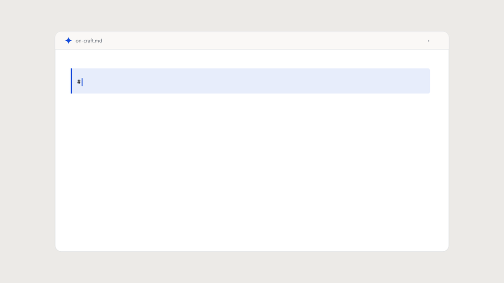

<div align="center">


# Rune

**The focused markdown writer for desktop.**

[](LICENSE)
[](https://github.com/JangHyun-bin/Rune/releases/latest)


[**⬇ Download**](https://github.com/JangHyun-bin/Rune/releases/latest) · [Why Rune?](#why-rune) · [Build from source](#development)

English · [한국어](README.ko.md)

</div>

---

<p align="center">
  
</p>

<!-- Screenshots: capture light & dark via `npm run tauri dev`, save to docs/screenshots/{light,dark}.png, then uncomment.
<p align="center">
  
  
</p>
-->

## What is Rune?

Rune is a cross-platform markdown writer that formats **as you type** — code, Mermaid diagrams, math, and tables turn live while the page stays calm. It's built in Rust ([Tauri 2](https://tauri.app)) for native speed and a small footprint, with **first-class Korean / CJK** typography.

## Features

- ✍️ **Inline live preview** — formatting applies as you type; only the cursor's line shows raw markdown
- 🎨 **Code highlighting · Mermaid · KaTeX math · GFM tables** — rich blocks render in place
- 🖼️ **Images** — paste or drop; saved beside your doc in `assets/` and shown inline
- 🗂️ **Workspace** — open a folder, browse the file tree, debounced autosave
- 🧩 **Multi-tab** — Chrome-like tabs; each keeps its own content, cursor, and undo history
- ⌘ **Command palette** (Ctrl/Cmd-K) **· full-text search · external-change watch**
- 📤 **Export** — self-contained HTML and PDF
- 🌐 **Four languages** — English · 한국어 · 日本語 · 简体中文
- 🌗 **Light & dark** — a calm, minimal theme
- ⚡ **Fast & small** — Rust core, native webview

## Download

Get the latest installer for your OS from the [**Releases**](https://github.com/JangHyun-bin/Rune/releases/latest) page:

| OS | Download |
|----|----------|
| **macOS** · Apple Silicon | [`Rune_0.1.9_aarch64.dmg`](https://github.com/JangHyun-bin/Rune/releases/download/v0.1.9/Rune_0.1.9_aarch64.dmg) |
| **macOS** · Intel | [`Rune_0.1.9_x64.dmg`](https://github.com/JangHyun-bin/Rune/releases/download/v0.1.9/Rune_0.1.9_x64.dmg) |
| **Windows** | [`.msi`](https://github.com/JangHyun-bin/Rune/releases/download/v0.1.9/Rune_0.1.9_x64_en-US.msi) · [`.exe`](https://github.com/JangHyun-bin/Rune/releases/download/v0.1.9/Rune_0.1.9_x64-setup.exe) |
| **Linux** | [`.deb`](https://github.com/JangHyun-bin/Rune/releases/download/v0.1.9/Rune_0.1.9_amd64.deb) · [`.rpm`](https://github.com/JangHyun-bin/Rune/releases/download/v0.1.9/Rune-0.1.9-1.x86_64.rpm) · [`.AppImage`](https://github.com/JangHyun-bin/Rune/releases/download/v0.1.9/Rune_0.1.9_amd64.AppImage) |

> **macOS:** CI builds signed DMGs. Notarization is currently a manual post-release step.

## Why Rune?

A calm, precise canvas for thinking and writing. Four principles guide it:

- **Focused** — one thing, done well; nothing between you and the words.
- **Quiet** — the interface recedes so the text leads.
- **Precise** — atomic saves and accurate rendering you can trust.
- **Structured** — structure creates freedom.

## Built with

[Tauri 2](https://tauri.app) (Rust core) · [CodeMirror 6](https://codemirror.net) · TypeScript · [Vite](https://vite.dev). Design system: [`docs/design.md`](docs/design.md).

## Development

```bash
npm install
npm run tauri dev            # run the desktop app (dev mode)
npm test                     # frontend tests (Vitest)
cd src-tauri && cargo test   # Rust core tests
npm run tauri build          # build installers for the current OS
```

Pushing a `v*` tag triggers GitHub Actions to build Windows/macOS/Linux installers and publish a release ([`.github/workflows/release.yml`](.github/workflows/release.yml)).

## Roadmap

- macOS notarization
- Performance & bundle code-splitting
- IME / CJK input refinements
- Plugin system (exploring)
- More export targets

## Contributing

Issues and PRs are welcome. Clone, run `npm install`, then `npm run tauri dev` to get started (see [Development](#development)). Translation help is especially appreciated — UI strings live in [`src/i18n/i18n.ts`](src/i18n/i18n.ts).

## Internationalization

The UI ships in **English · 한국어 · 日本語 · 简体中文**, switchable in Settings (⚙) and auto-detected from your OS.

## License

[MIT](LICENSE) © 2026 Hyunbin Jang
